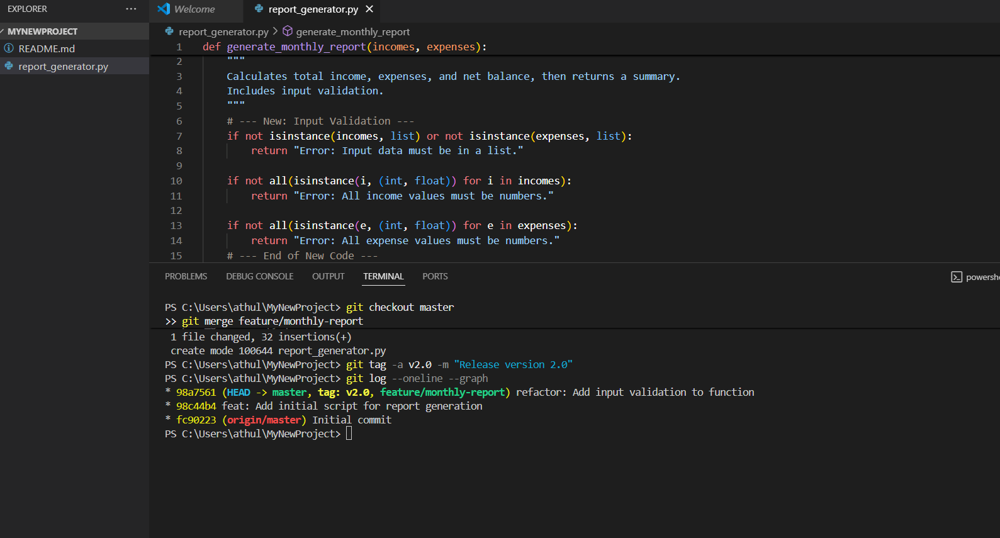

# CO2 Lab Report: Git Workflow Simulation

This report documents the process of simulating a feature development workflow using Git for the CO2 lab experiment.

## Git Operations Used

Below are the primary Git commands I used during this assignment:

* **`git init`**: To initialize a new, empty Git repository in my project folder.
* **`git checkout -b <branch-name>`**: To create and switch to a new feature branch.
* **`git add <file>`**: To stage changes for the next commit.
* **`git commit -m "message"`**: To save a snapshot of the staged changes to the project's history.
* **`git checkout <branch-name>`**: To switch back to the main branch.
* **`git merge <branch-name>`**: To merge the completed feature branch back into the main branch.
* **`git tag -a <tag-name> -m "message"`**: To create an annotated tag to mark a release.
* **`git push`**: To upload local commits and tags to the remote repository on GitHub.

## Branch Structure & Log

The following screenshot shows the output of the `git log --oneline --graph` command, which visualizes the branching and merging history of the project.

---

---

## Summary of What I Learned

In this lab, I learned the fundamental workflow of feature development using Git. The key takeaways for me were the importance of using feature branches to isolate work, which prevents destabilizing the main codebase. I also learned how making small, incremental commits with clear messages creates a clean and understandable project history. Finally, merging branches and tagging releases are crucial steps for integrating features and marking official versions of the software.